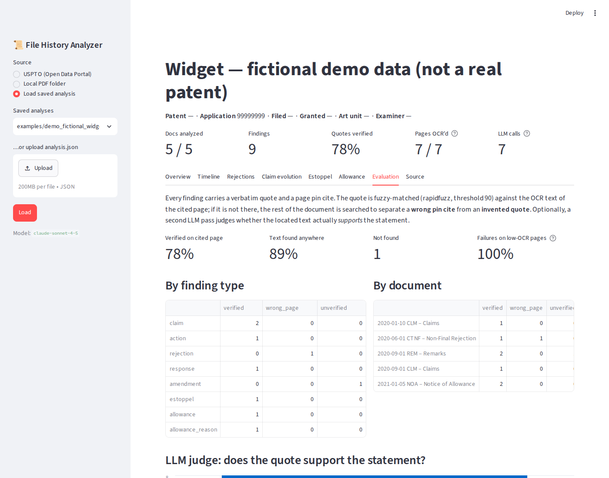
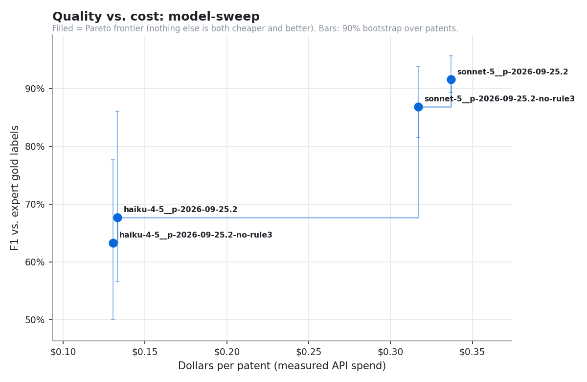
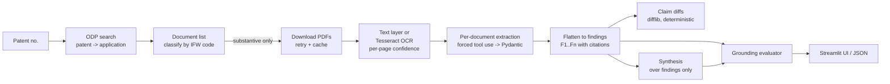

# File History Analyzer

Give it a US patent number. It pulls the prosecution history (file wrapper) from the
**USPTO Open Data Portal API**, OCRs the scanned documents, and uses an **LLM** to extract a
prosecution summary, rejections, amendments, claim evolution, and reasons for
allowance. Then it **checks the model's work**: every finding has to cite a verbatim quote
and page number, and each quote is verified against the OCR text before you're asked to
trust it.

> Built by a patent litigation analyst. The goal is a tool whose output you can
> actually rely on in a claim-construction or invalidity workflow. That means
> "show me where it says that" matters more than a fluent summary.



## Results at a glance

Measured against 243 expert-labeled findings in the file histories of five litigated
patents ([full write-up](docs/results/model-sweep.md)):

| Model and prompt | F1 (90% CI) | Precision | Recall | $ per patent | Quotes verified |
|---|---:|---:|---:|---:|---:|
| **Sonnet 5, current prompt** | **92%** (89–96) | 87% | **96%** | $0.34 | **99%** |
| Sonnet 5, without the "report everything" rule | 87% (82–94) | **96%** | 79% | $0.32 | 99% |
| Haiku 4.5, current prompt | 68% (57–86) | 73% | 63% | $0.13 | 84% |

- **Sonnet is the choice.** Haiku is 60% cheaper but loses 24 points of F1, collapses on
  long office actions, and cites less reliably (84% of quotes verified against 99%).
- **The prompt rule trades precision for recall.** Error analysis showed that much of the
  gap comes from how the labels count sub-grounds, so the labeling convention is being
  fixed before prompt variants are ranked.
- **The first Opus 5.5 run failed on every call** (the model rejects forced tool use).
  The runner now keeps such configurations off the quality-vs-cost frontier, and the
  client falls back to `tool_choice: auto`.



## What it does

| Tab | Contents |
|---|---|
| **Overview** | Short narrative plus key points. Each point links to the findings that support it, colored by whether their quotes were verified |
| **Timeline** | Every document in the wrapper, classified by type (substantive vs. forms/fees), plus what happened at each step |
| **Rejections** | Each ground of rejection: claims, statutory basis (§101/102/103/112), references relied on, examiner's reasoning |
| **Claim evolution** | Each independent claim from filing to allowance, with word-level diffs (added / removed) |
| **Estoppel** | Argument-based disclaimer, amendment-based (Festo) estoppel, and lexicography, rated high / medium / low risk with a rationale. *Currently switched off* (see below) |
| **Allowance** | The examiner's reasons for allowance and any examiner's amendment |
| **Family** | The full INPADOC family (US and foreign members) from EPO Open Patent Services and every search-report citation (X/Y/A) made anywhere in it. Art that was **never of record in the analyzed patent** (its face citations and its own prosecution) is flagged, with the EP/ISR passages and claims it was cited against. Exports to CSV |
| **Priority** | For patents in a continuation / CIP chain: the continuity chain back to the earliest provisional, and a claim-element × application grid of written-description support in each application *as filed* (verbatim quotes, verified against the OCR). Computes the earliest filing date each claim can be entitled to, since every application on the path must support every element, and diffs each CIP against its parent to flag support that exists only in added matter |
| **Evaluation** | Grounding metrics, failure breakdown by finding type and document, and a review queue |
| **Source** | The OCR text of any page with the cited quote highlighted, next to the original page image |

## Architecture



```
src/fh_analyzer/
  uspto.py      ODP client: number normalization, search, documents, downloads (429/5xx backoff, disk cache)
  family.py     EPO OPS client (OAuth2, token refresh, quota errors): family + citations, US-record matching
  doc_codes.py  IFW document-code taxonomy: which of ~100 documents are worth analyzing
  ocr.py        PyMuPDF text layer -> Tesseract fallback, per-page confidence, page-tagged rendering
  models.py     Pydantic output schemas; every item carries a Citation(doc_id, page, quote)
  prompts.py    Versioned prompts, one per document type; registry of prompt versions
  llm.py        Anthropic client: forced tool use, schema validation + one corrective retry, prompt caching, token accounting
  pipeline.py   Orchestration (map per document -> reduce), caching, offline folder mode
  claims.py     Claim version history + word-level diffs
  completeness.py  Omission tripwires on the OCR text + targeted retry
  priority.py   Continuity chain, as-filed disclosures, claim-element support, entitlement, CIP diff
  costs.py      Per-call cost log (tokens, $, latency, stage), price table, budget guard, estimates
  costs_cli.py  fh-costs: cost reports across runs
  experiment.py Grid runner: model x prompt x options over the gold set, F1 vs $, Pareto frontier
  experiment_cli.py  fh-experiment command
  evalset.py    Gold-label schema, matching, precision/recall/kappa scorer (fh-score)
  grounding.py  Citation verification, LLM-as-judge support check, synthesis traceability, report
  cli.py        `fh-analyze` command
app.py          Streamlit UI
experiments/    Example grid files for fh-experiment
label_app.py    Expert labeling UI for the benchmark set
```

## How the results are evaluated

The model can be wrong in several different ways, and each needs a different fix. The
evaluator is built to tell them apart.

**1. Quote verification (deterministic, free).** Each finding's quote is fuzzy-matched
(`rapidfuzz.partial_ratio_alignment`) against the OCR text of the cited page, after
normalizing whitespace, quotes, dashes and line-break hyphenation. Each finding gets one
of these statuses:

| Status | Meaning | Likely cause |
|---|---|---|
| `verified` | Score ≥ 90 on the cited page | — |
| `wrong_page` | Not on the cited page but ≥ 90 elsewhere in the same document | Pin-cite error: real text, wrong page |
| `partial` | 75–90 on the cited page | Model "cleaned up" OCR, or merged fragments |
| `unverified` | Not found anywhere in the document | Paraphrase or fabrication |
| `bad_reference` | Cited a document or page that isn't in the input | Fabrication |

The threshold is 90, not 100, because the source is OCR output. A model that silently fixes
`hous1ng` to `housing` still points at the right text. Paraphrase scores well below 90.

**2. OCR vs. model attribution.** Every OCR page records Tesseract's mean word confidence.
The report shows what share of failed quotes sit on low-confidence pages. If that share
is high, fix the OCR (higher DPI, preprocessing). If it's low, fix the prompt or the model.

**3. Support check (optional LLM-as-judge).** A verified quote proves the text exists. It
doesn't prove the text supports the statement: a real quote can sit under an overstated
"clear and unmistakable disavowal." With `--judge`, a separate prompt sees only the
statement and the page text and returns `supported` / `partial` / `unsupported`. Only
findings whose text was located are judged.

**4. Synthesis traceability.** The overview is generated *from the findings, not the raw
text*. Every key point must reference finding ids. The report counts dangling ids and
points that aren't anchored to at least one verified quote.

**5. Completeness tripwires (omissions).** Grounding measures precision; it can't see what
the model left out. Cheap regex checks on the OCR text catch the obvious misses: an office
action that says "rejected under" but has no rejections recorded, remarks full of argument
language with no amendments or estoppel items, a real statement of reasons for allowance
with no reasons. A tripped check triggers one retry with targeted feedback. Anything still
unresolved is listed on the Evaluation tab. (This was added after live runs showed the model
putting everything into the summary and leaving the structured lists empty. Two fixes
followed: every schema field is now marked required in the tool schema, and the tripwires
confirm it.)

**6. Deterministic where possible.** The LLM only transcribes claim listings. The diffs
between versions are computed with `difflib`. A diff on a claim whose status says
"previously presented" is flagged as likely OCR noise, not reported as an amendment.

The **review queue** in the Evaluation tab lists every finding that isn't cleanly verified
and supported, so a reviewer starts with the items most likely to be wrong.

### Expert-labeled benchmark (precision and recall)

Grounding measures *traceability*. It can't tell whether an estoppel risk rating is right,
or what the model missed. For that, the project includes an expert-labeled benchmark
built with its own review tool (`label_app.py`):

- **Pre-filled labels.** Each model finding becomes a draft label. A patent analyst
  (the author) marks it ✅ correct, ✏️ fixes it to the true values, or ❌ rejects it and
  tags why (hallucinated, boilerplate, wrong claims, wrong basis, wrong risk,
  overstated, ...).
- **Model misses are added by hand.** This is what makes recall measurable.
- **Only reviewed documents are scored.** A document counts only after the labeler
  marks it reviewed, so an unlabeled document can't be mistaken for a model miss.
- **Stored in `gold/<application>.json`** in the repo.

`fh-score` then scores *any* run (another model, another prompt version) against the
labels:

- Items are matched per document and type (claim-set overlap, statutory basis,
  references, limitation text and quote similarity).
- It reports **precision / recall / F1 per finding type** and **field accuracy** on
  matched items.
- For estoppel risk it reports a confusion matrix and **weighted Cohen's kappa**
  between the model and the expert.

Error tags from the labeling feed the failure analysis.

*Caveat:* pre-filled labels make labeling several times faster but can anchor the
labeler toward the model's answer. Reading each document in full and the explicit
"add missed item" step counter this. For a stricter subset, label some documents
without looking at the model's output first.

## Cost accounting

Every model call is recorded, including failed validations and retries, with its stage
(extract, completeness retry, synthesis, judge, priority), document type, model, prompt
version, tokens (input / output / prompt-cache write / prompt-cache read), latency and
dollar cost.

- **Tokens are the source of truth.** Dollars come from `src/fh_analyzer/pricing.json`,
  which is dated and cites the pricing page. `fh-costs --reprice` recomputes history when
  prices change. A model missing from the table is reported as *unpriced*, never as $0.
- **Where it shows up:**
  - Each analysis stores a cost summary: total, by stage, by document type, prompt-cache
    hit rate, p50/p95 latency, and documents served free from the extraction cache.
  - The header shows the total; the Evaluation tab has the breakdown.
  - The Priority tab estimates the cost *before* you run it (disclosure size × elements,
    with prompt caching) and reports the actual cost after.
- **How it's logged:** calls are appended to `data/costs/calls.jsonl`. `fh-costs` answers
  "what does a patent cost to analyze?" and "where does the money go?", and gives the
  dollar axis for model and prompt experiments.
- **Budget:** `FHA_MAX_USD_PER_RUN` stops a run once it has spent that much.
- **Implementation:** context (stage, document) is attached with a `contextvars` context
  manager around each call, so the LLM interface did not change and the fake models in
  the test suite still work.

## Experiments: quality vs. cost

Latest results: [docs/results/model-sweep.md](docs/results/model-sweep.md).

`fh-experiment` answers "which model and prompt should I actually use?" with measured
numbers instead of impressions. A grid file lists the options to vary:

```yaml
name: model-sweep
grid:
  model: [claude-sonnet-5, claude-haiku-4-5, claude-opus-5-5]
  prompt: [2026-09-25.2, 2026-09-25.2-no-rule3]
fixed:
  judge: false
budget_usd: 25
```

- **Every combination is one configuration** (here 3 models × 2 prompt versions = 6).
  Options: `model`, `prompt` (a registered version or a folder of `.txt` prompts),
  `completeness_retry`, `strict`, `judge`, `max_tokens`.
- **It runs on the labeled patents using the saved OCR text**, so there is no download
  or OCR, and every configuration sees exactly the same input.
- **Each run is saved** as `runs/<experiment>/<configuration>/<app>.json`, in the same
  format the app uses. Runs are resumable, and no extraction cache is shared between
  them, so every configuration's dollars are its own measured spend.
- **Scoring uses the `fh-score` scorer** against `gold/`. The results are combined into
  `runs/<experiment>/results.md` and `results.csv`, with one row per configuration:
  micro-F1, a bootstrap interval over patents, precision, recall, F1 by finding type,
  $ per patent and citation-verified rate.
- **The main chart** (`frontier.png`) plots F1 against $ per patent. The **Pareto
  frontier** is highlighted: the configurations that nothing else beats on both quality
  and cost. Those are the real choices, and everything off the frontier is dominated.
- **`repeats: N`** runs each configuration several times. The models aren't
  deterministic, so this shows the run-to-run noise, and a gap between two
  configurations smaller than that noise isn't a finding.
- **Prompt versions are kept, not overwritten.** `prompts.REGISTRY` holds each version.
  `2026-09-25.2-no-rule3` is an ablation that removes the "report ALL of it" rule added
  after early runs returned empty rejection lists, so its value can be measured.
- `--dry-run` lists the configurations with a rough cost estimate before anything is
  spent, and `budget_usd` stops the experiment at a cap (re-running resumes).

### Estoppel analysis (switched off for now)

The estoppel / disclaimer extraction is paused while the project focuses on rejections,
amendments, claim evolution and allowance. The code is all still here. Set
`FHA_ESTOPPEL=1` to turn it back on: filings are then extracted with the estoppel list
again, the Estoppel tab comes back, and estoppel is scored. With it off, filings use a
smaller prompt and schema (amendments only), the claim-amendment list moves to the Claim
evolution tab, and runs record `features: {"estoppel": false}` so the scorer leaves
estoppel out instead of counting it as missed.

## Patents used in this repository

The benchmark and experiments use five litigated patents whose file histories are public.
In four of the five, a Federal Circuit decision turned on the prosecution record itself,
so readers can check the tool's output against what the court said about the same
documents:

| Patent | Application | Subject | Case | Why it's a useful test |
|---|---|---|---|---|
| US 8,046,721 | 12/477,075 | Slide-to-unlock touchscreen gesture (Apple) | *Apple v. Samsung* (obviousness, not prosecution history) | Clean, well-documented prosecution: double patenting, §102/§103, after-final practice and an advisory action |
| US 8,702,308 | 12/262,027 | Elastic drawstring trash bag (Poly-America) | *Poly-America v. API Industries* (Fed. Cir. 2016) | Disclaimer found from statements distinguishing the prior art; long back-and-forth over the same references |
| US 8,900,294 | 14/253,656 | Controlled release of a replacement heart valve (Colibri) | *Colibri v. Medtronic CoreValve* (Fed. Cir. 2025) | Claims canceled after a §112(a) written-description rejection, which later barred the doctrine of equivalents; many new and amended claims |
| US 10,469,966 | 16/383,565 | Zone scene management for networked speakers (Sonos) | *Google v. Sonos* (Fed. Cir. 2025, prosecution laches) | Short, fast prosecution: one §103 rejection over a product manual, an examiner's amendment and reasons for allowance |
| US 10,858,176 | 16/538,752 | Coffee capsule with barcode identifier (K-fee) | *K-fee v. Nespresso* (Fed. Cir. 2023) | Dense office actions (up to 17 grounds, many §112 issues), which is the hardest case for the models |

Gold files are named by application number (e.g. `gold/12477075.json`). Numbers are resolved to application numbers
through the USPTO Open Data Portal, so `fh-analyze 8046721` is all that's needed. The
Portal's file-wrapper data mainly covers applications filed from 2001 on. `examples/`
holds a small fictional demo used by the tests and the screenshots.

### Keeping confidential matters out of the repo

Everything a run produces (`data/cache`, `data/costs`, `gold`, `runs`) lives under a
*workspace*. The default workspace is the repo itself. For client work, set

```bash
set FHA_WORKSPACE=private        # Windows (Anaconda Prompt)
export FHA_WORKSPACE=private     # macOS / Linux
```

`private/` is git-ignored, so its analyses, labels, cost logs and experiment runs can't
be committed by accident. The sidebar shows a 🔒 badge while a private workspace is
active. `FHA_CACHE_DIR`, `FHA_COST_LOG` and `FHA_GOLD_DIR` still override individual paths.

## Design decisions

- **Classify before OCR.** A mature file wrapper has 100+ documents, and most are fee
  sheets, receipts and IDS forms. Filtering by IFW document code, with a
  description-keyword fallback, cuts OCR time and token cost and keeps noise out of the
  context.
- **One document per LLM call (map), then reduce over structured findings.** Each call has
  a focused prompt and schema for its document type, citations stay local to one document,
  and calls run in parallel. The synthesis never sees raw text, so it can only restate
  findings that were already checked.
- **Forced tool use for structured output.** The Pydantic schema becomes the tool's
  `input_schema`. The model's output is validated, and a validation error is fed back
  for one corrective retry.
- **Everything is cached**, keyed by model and prompt version: API responses, PDFs, OCR
  text, and per-document extractions. Re-running after a prompt change only repeats the
  LLM step.
- **Self-contained output.** `analysis.json` stores the page texts, so grounding can be
  re-run and every citation inspected without re-downloading anything.
- **Family art is matched, not just listed.** Citation numbers are normalized to a
  kind-less DOCDB key (e.g. `US 2005/0123456` and `US.2005123456.A1` both become
  `US2005123456`) and compared against everything on the face of the US patent plus the
  references named in the extracted rejections. What's left is art another office found
  that the US examiner never saw. That's the list you want for an IPR or invalidity search.
- **Testable without keys.** The LLM sits behind a one-method protocol. The test suite runs
  the whole pipeline against a scripted fake model that includes one deliberate wrong-page
  cite and one fabricated quote, and asserts that the evaluator catches both.

## Setup

```bash
git clone https://github.com/<you>/file-history-analyzer && cd file-history-analyzer
python -m venv .venv && source .venv/bin/activate      # Windows: .venv\Scripts\activate
pip install -e ".[dev]"
cp .env.example .env                                     # then add your keys
```

- **USPTO API key:** register at the [Open Data Portal](https://data.uspto.gov/apis/getting-started)
  (requires ID.me verification). ODP covers applications filed on or after 2001-01-01.
- **Anthropic API key:** [console.anthropic.com](https://console.anthropic.com). Set the
  model with `FHA_MODEL`.
- **EPO OPS key (optional, for the Family tab):** free registration at
  [developers.epo.org](https://developers.epo.org). Create an app and put its consumer key
  and secret in `EPO_OPS_KEY` / `EPO_OPS_SECRET`. A family lookup is a single request.
- **Tesseract OCR:** `apt install tesseract-ocr` / `brew install tesseract`. On Windows,
  install the [UB Mannheim build](https://github.com/UB-Mannheim/tesseract/wiki) and set
  `TESSERACT_CMD` in `.env` if it isn't on PATH.

## Usage

```bash
streamlit run app.py                       # UI
fh-analyze 10,123,456                      # CLI; writes data/cache/<app>/analysis.json
fh-analyze 10123456 --judge                # add the LLM support check
fh-analyze 10123456 --family               # add patent family + citations (EPO OPS)
fh-analyze --folder ./wrapper_pdfs         # offline: a folder of PDFs (e.g. a Patent Center ZIP)
streamlit run label_app.py                 # review/label findings -> gold/<app>.json
fh-score                                   # score the latest runs against the gold labels
fh-score --runs a.json b.json --json r.json   # compare runs, write full report
fh-costs                                   # cost report: by day, patent, stage, document type, model
fh-costs --by model --reprice              # recompute $ from logged tokens with today's prices
fh-experiment experiments/model_sweep.yaml --dry-run   # configurations + rough cost, no API calls
fh-experiment experiments/model_sweep.yaml   # run the grid -> runs/model-sweep/results.md + frontier.png
fh-score --experiment runs/model-sweep     # re-score an experiment after adding gold labels
pytest -q && ruff check .                  # tests + lint
```

To look around without API keys, choose **Load saved analysis** in the UI and open
`examples/demo_fictional_widget.json`. It's a small *fictional* file history used by the
test suite, and it deliberately includes one wrong-page cite, one fabricated quote and
one dangling synthesis reference, so every evaluator state is visible.

## Known limitations

- **Amendment markup.** Claim amendments mark added text with underlining, which OCR loses.
  Deleted text in `[[brackets]]` usually survives, strikethrough often doesn't. Claim text
  from amended listings is the model's best reconstruction, which is why claim diffs flag
  suspected noise.
- **OCR quality** on older scans can be poor. Low-confidence pages are flagged throughout.
- **Benchmark size.** Recall and precision are only as representative as the labeled set;
  it covers a handful of patents so far.
- **Family scope.** OPS gives citations and categories, not the European file
  wrapper itself; the EP Register link opens those documents. Non-patent literature can't
  be matched to the US record automatically and is shown as "?".
- This is an analysis aid, not legal advice. Verify against the file wrapper.

## License

MIT
